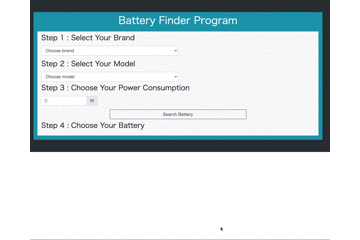

# Battery Finder Program - Project 2 (second)
from [Recursion](https://recursionist.io)

## Description
Camera brand, modelそれぞれのオブジェクトリスト内と消費電力を0 <= x =< 100 の範囲でUserがスペックを選択し、条件にあったBatteryが画面に表示される。
条件に合わない場合はエラーメッセージが表示される。

データ構造のHashMapを使い効率的にリストへアクセスし、重複を削除。
バッテリーの容量によりソートして出力。

## URL
[Battery Finder Program](https://soysan.github.io/Battery-Finder-Program/)
## Demo

## Requirement
Bootstrap 4.5が使えるブラウザ

## Author
[@soylove2](https://twitter.com/soylove2)
